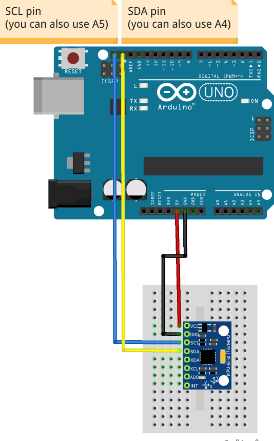
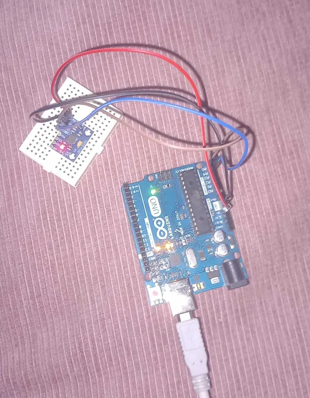
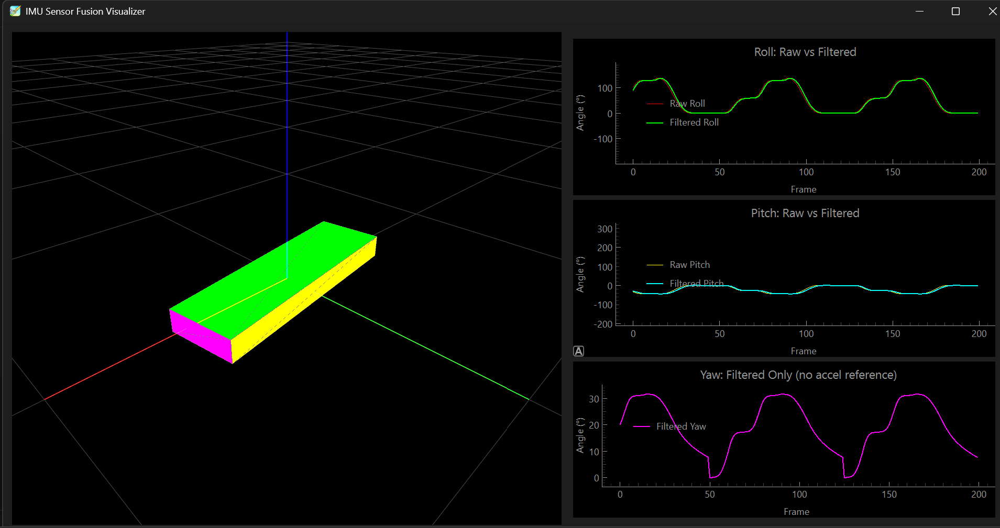

# MPU6050 Real-Time IMU Sensor Fusion 

This project implements a live orientation estimator using an MPU6050 IMU on an Arduino Uno.
Raw accelerometer and gyroscope data are fused using a **complementary filter** to estimate roll,
pitch, and yaw. A Python tool logs the data and a 3D visualizer replays it with a comparison of raw vs. filtered signals.

## Features
- Complementary filter sensor fusion (α=0.95 gyro, α=0.05 accel)
- Gyroscope auto-calibration on startup
- Raw vs. filtered angle output for comparison
- Serial output in CSV format
- 3D visualizer
- 2D **live** plots comparing raw and filtered roll/pitch/yaw

## Hardware
- Arduino Uno
- MPU6050 sensor module
- Jumper wires
- Mini Breadboard(optional)

## Libraries
### Arduino
- MPU6050_tockn
- Wire

### Python
- PyQt6
- pyqtgraph
- PyOpenGL
- PyOpenGL_accelerate
- numpy

## Running Instructions
1. Upload `MPU_CODE.ino` to the Arduino Uno while wired up.
2. Close Arduino IDE to free the port (if its still open there will be port conflict).
3. Run `pythonterminal.py` in the terminal.
4. Press `Ctrl+C` to stop recording. Data (5 columns) saves to `movement.txt`. (To record data just move the breadboard)
5. Run `visualiser.py` to replay the 3D visualization and view raw vs. filtered plots.
**Note that I already have a prefiled movement.txt so you can test the visualizer right away!**
   
## CSV Data Format
Each row in `movement.txt` contains 5 columns:
- **roll_raw / pitch_raw** — angle calculated from the accelerometer ONLY(shaky)
- **roll_filtered / pitch_filtered / yaw_filtered** angle after filtering(smooth)

## Analysis: Noise, Drift, and Limitations

### Complementary Filter
The filter combines two imperfect sensors to get one good estimate. The gyroscope is smooth but
slowly goes wayyy off over time. The accelerometer is stable long term but shaky. By mixing them
(95% gyroscope, 5% accelerometer), the result is both smooth and accurate(i hope).

### Noise
The raw accelerometer angle jumps around A LOT, especially when the sensor is moving quickly.
The filter cleans this up, though it can be slightly slow to react to very quick movements.

### Gyroscope Drift
The gyroscope measures how fast the sensor is rotating, and the code adds those up over time to
get an angle. Small measurement errors add up too, so the angle slowly creeps away from reality.
**Yaw** (left/right rotation) is the worst affected because there is nothing to correct it —
unlike roll and pitch, which are kept honest by the direction of gravity.
### Rate
Loop runs at 50ms. Slow  movements are captured well.Very fast rotations
may be depicted worse.

### Filtered vs. Unfiltered
| Signal | Noise | Drift |
|---|---|---|
| Raw accelerometer (roll/pitch) | High | None |
| Gyroscope integration only | Low | Unbounded |
| Complementary filter output | Low | Minimal (roll/pitch), moderate (yaw) |

## Wiring

## Visualizer Example

## Demo Video

