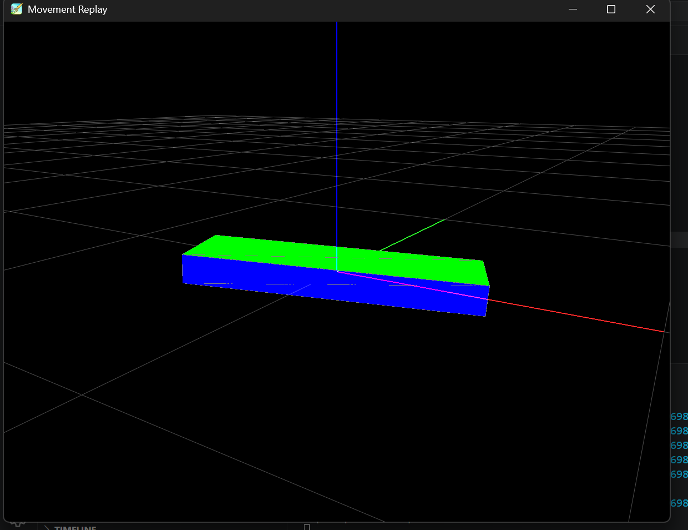

# MPU6050 Angle Tracking (Arduino)

This project uses the MPU6050 sensor to calculate **roll, pitch, and yaw angles** on an Arduino, track the data in a .txt file and display it on a 3D visualizer!

## Features
- Live roll, pitch, and yaw output
- Gyroscope auto-calibration on startup
- Noise reduction
- Serial output in CSV format

## Hardware 
- Arduino Uno
- MPU6050 sensor module
- Jumper wires
- Mini Breadboard (optional)

## Libraries 
### Arduino
- MPU6050_tockn
- Wire
### Python
- pyqtgraph
- numpy

## ⚠️ Running Instructions ⚠️
1) Upload the .ino code to the Arduino Uno, while wired in your device.
2) Run pythonterminal.py IN THE TERMINAL, while arduino IDE is closed. (This avoids port conflicts)
3) Press Ctrl-C when you're done recording data(to get data just shake around the breadboard).
4) Run visualizer.py to view the movement in 3D.

A testing case can be found in the video within the repo.

## Wiring

## Visualizer Example

